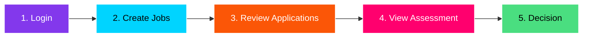
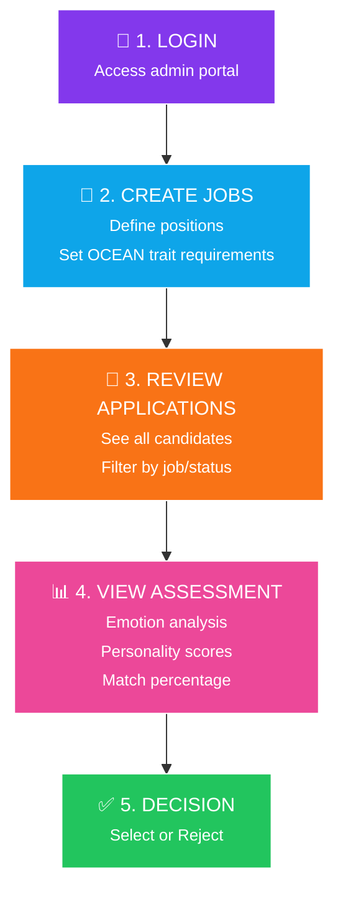
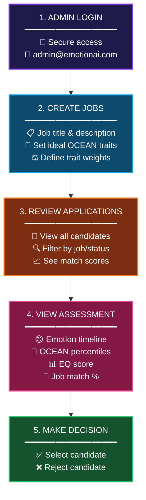
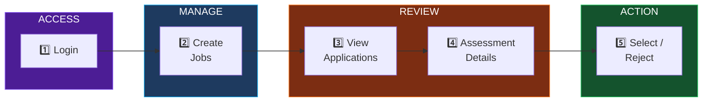
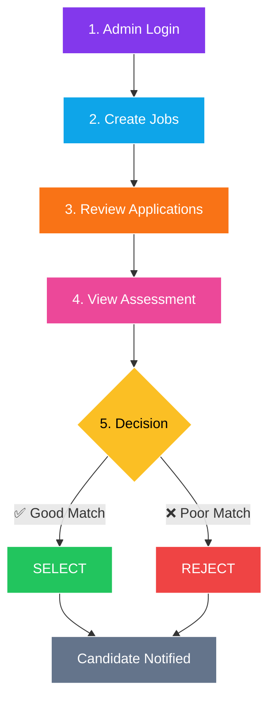
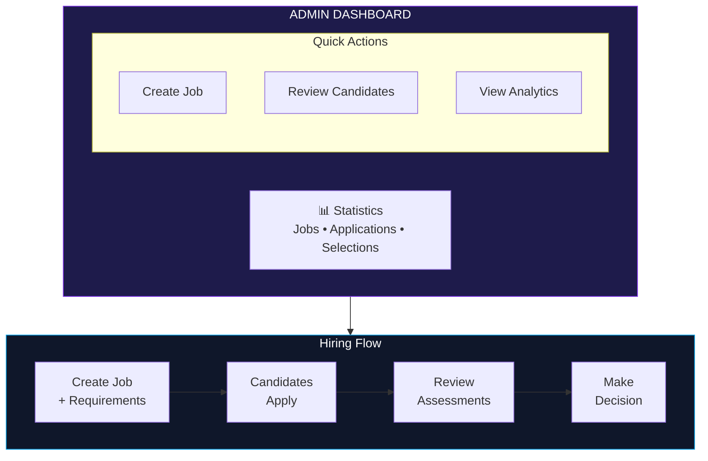

# Admin Journey Flow Diagram

## Simple Linear Flow



---

## Detailed Vertical Flow



---

## With Details (Best for Slides)



---

## Horizontal with Phases



---

## Decision Flow with Branches



---

## Admin Dashboard Overview



---

## ASCII Box Version (For PPT)

```
┌─────────────────────────────────────────────────────────────────┐
│                      ADMIN JOURNEY                               │
├─────────────────────────────────────────────────────────────────┤
│                                                                  │
│  ┌──────────────┐         ┌──────────────┐                      │
│  │ 1. LOGIN     │────────►│ 2. CREATE    │                      │
│  │              │         │    JOBS      │                      │
│  │ Admin portal │         │ • Title      │                      │
│  │              │         │ • OCEAN reqs │                      │
│  └──────────────┘         └──────┬───────┘                      │
│                                  │                               │
│                                  ▼                               │
│  ┌──────────────┐         ┌──────────────┐                      │
│  │ 3. REVIEW    │◄────────│ Candidates   │                      │
│  │ APPLICATIONS │         │ Apply        │                      │
│  │              │         │              │                      │
│  │ • All users  │         └──────────────┘                      │
│  │ • Filter     │                                               │
│  │ • Match %    │                                               │
│  └──────┬───────┘                                               │
│         │                                                        │
│         ▼                                                        │
│  ┌──────────────┐         ┌──────────────┐                      │
│  │ 4. VIEW      │────────►│ 5. DECISION  │                      │
│  │ ASSESSMENT   │         │              │                      │
│  │              │         │ ┌──────────┐ │                      │
│  │ • Emotions   │         │ │ ✅ SELECT │ │                      │
│  │ • OCEAN      │         │ └──────────┘ │                      │
│  │ • EQ Score   │         │ ┌──────────┐ │                      │
│  │ • Match %    │         │ │ ❌ REJECT │ │                      │
│  └──────────────┘         │ └──────────┘ │                      │
│                           └──────────────┘                      │
│                                                                  │
└─────────────────────────────────────────────────────────────────┘
```

---

## Summary Table

| Step | Action | Details |
|------|--------|---------|
| 1 | Login | Access admin portal with credentials |
| 2 | Create Jobs | Define positions, set OCEAN trait requirements |
| 3 | Review Applications | View all candidates, filter by job/status |
| 4 | View Assessment | See emotion analysis, OCEAN scores, match % |
| 5 | Decision | Select or reject candidates |
