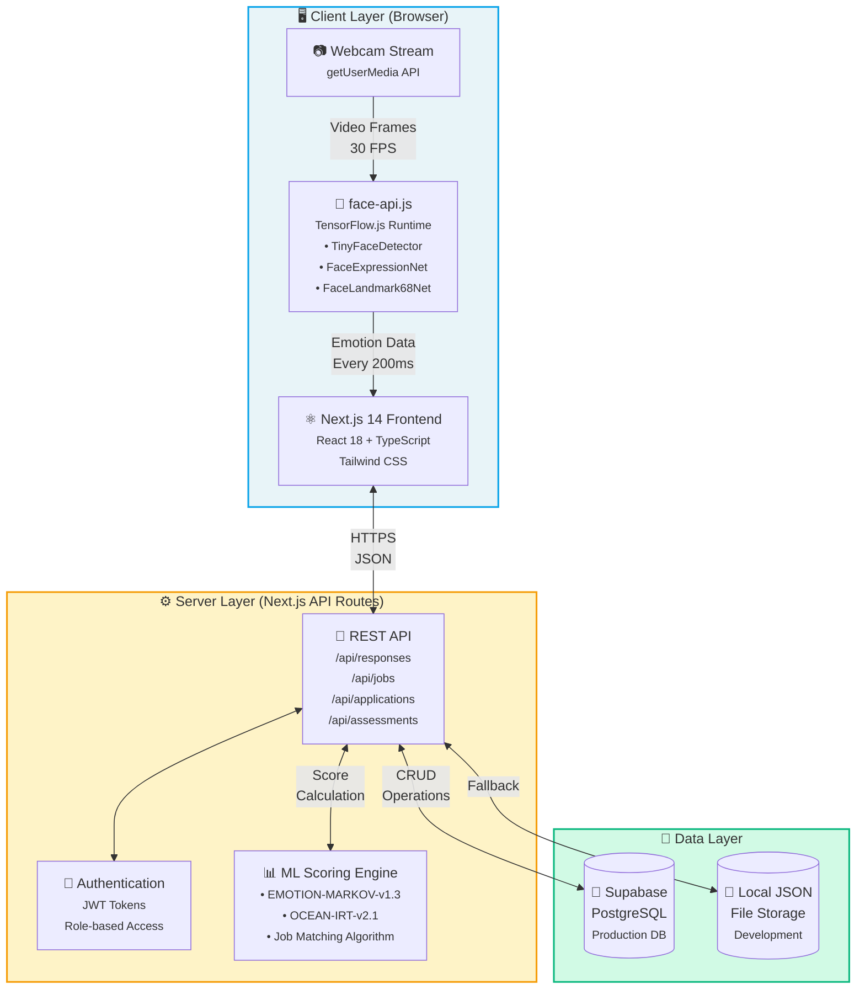
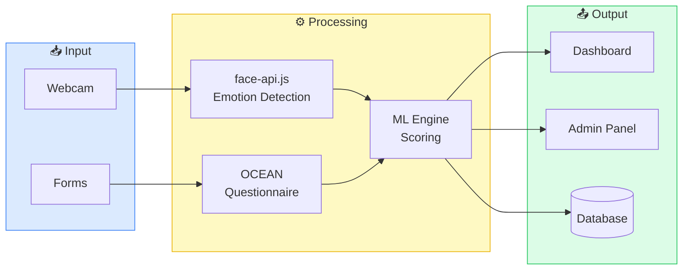
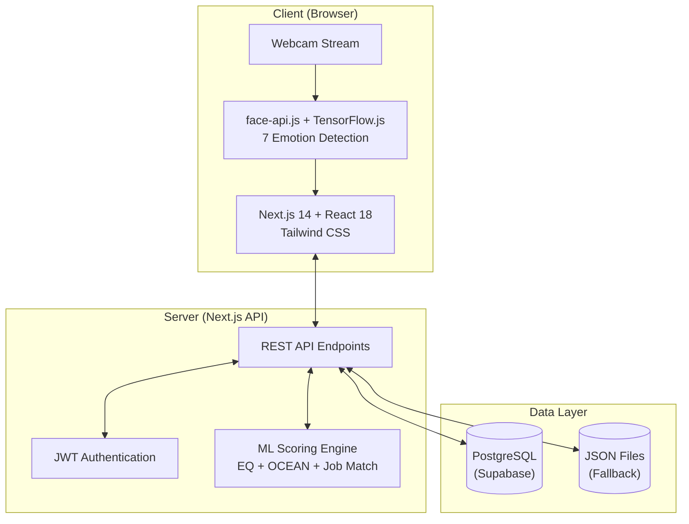

# Enhanced System Architecture

## Detailed Architecture Diagram



## What to Add to Your Slide:

### 1. Add Technology Labels (Versions)
- Next.js **14** + React **18**
- TensorFlow.js **4.x**
- PostgreSQL **15**
- Node.js **18**

### 2. Add Data Flow Annotations
Show what data flows between components:
- Webcam → face-api: **Video frames (30 FPS)**
- face-api → Frontend: **Emotion JSON (every 200ms)**
- Frontend → API: **Assessment payload**
- API → ML: **Raw data for scoring**
- ML → API: **Calculated scores**

### 3. Add Component Counts/Stats
- **7** emotions detected
- **25** personality questions
- **5** OCEAN traits
- **6** API endpoints

### 4. Add Key Features per Layer

**Client Layer:**
- Real-time face detection
- Emotion classification
- Responsive UI

**Server Layer:**
- RESTful API design
- JWT authentication
- ML model inference

**Data Layer:**
- Persistent storage
- Query optimization
- Fallback support

---

## Alternative: Horizontal Layout



---

## Suggested Slide Layout:

```
┌─────────────────────────────────────────────────────────────┐
│  SYSTEM ARCHITECTURE                                        │
├─────────────────────────────────────────────────────────────┤
│                                                             │
│  ┌─────────────────────────────────────────────────────┐   │
│  │                [DIAGRAM HERE]                        │   │
│  │                                                      │   │
│  └─────────────────────────────────────────────────────┘   │
│                                                             │
│  ┌──────────────┐ ┌──────────────┐ ┌──────────────┐        │
│  │ CLIENT       │ │ SERVER       │ │ DATABASE     │        │
│  │ • Next.js 14 │ │ • API Routes │ │ • PostgreSQL │        │
│  │ • React 18   │ │ • JWT Auth   │ │ • Supabase   │        │
│  │ • face-api   │ │ • ML Engine  │ │ • JSON Files │        │
│  │ • TailwindCSS│ │ • TypeScript │ │              │        │
│  └──────────────┘ └──────────────┘ └──────────────┘        │
│                                                             │
│  Key: 7 Emotions | 25 Questions | 5 Traits | <2s Analysis  │
└─────────────────────────────────────────────────────────────┘
```

---

## Simple Version for Slides (Copy This)



## Add These Bullet Points Below Diagram:

**Technologies:**
- Frontend: Next.js 14, React 18, TypeScript, Tailwind CSS
- AI/ML: face-api.js, TensorFlow.js (browser-based)
- Backend: Next.js API Routes, JWT Authentication
- Database: Supabase (PostgreSQL), Local JSON fallback
- Deployment: Docker, Nginx, Port 3005
