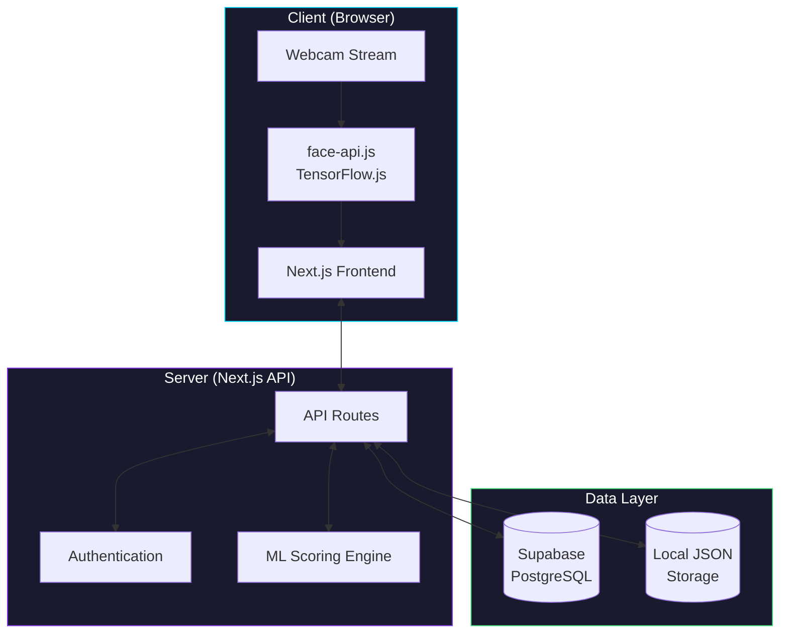
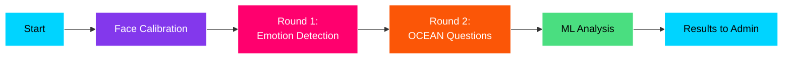
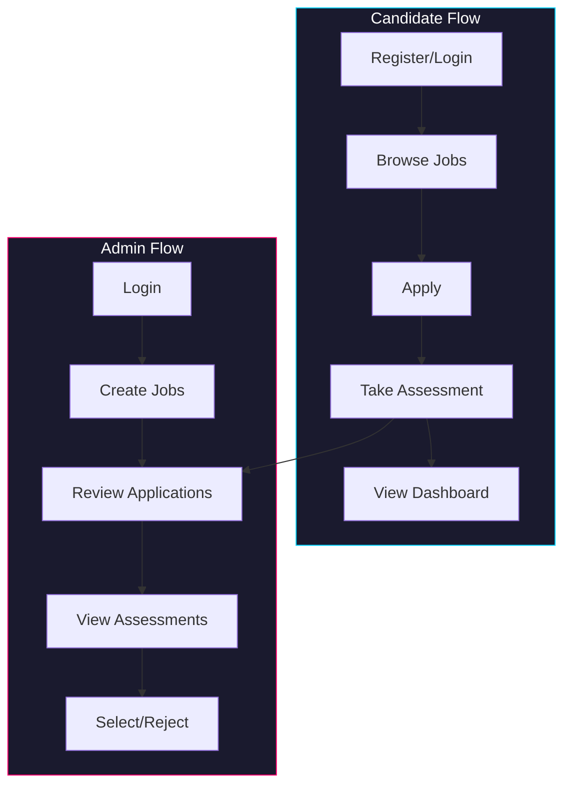
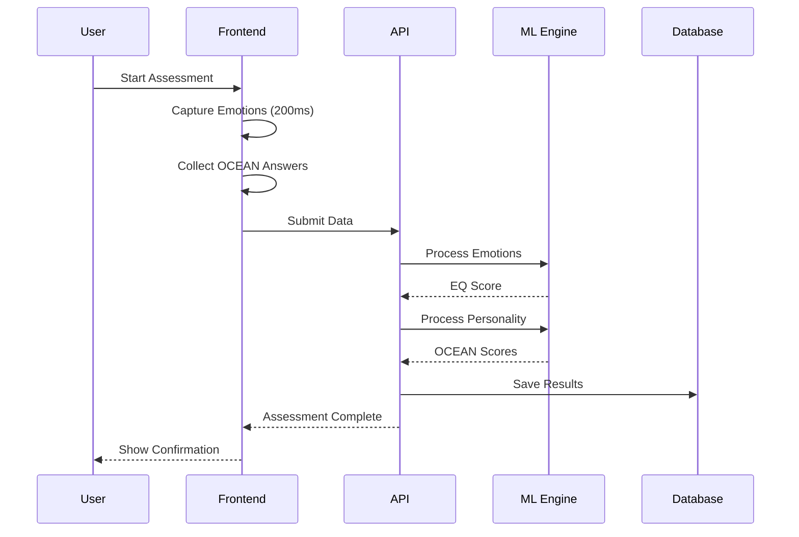
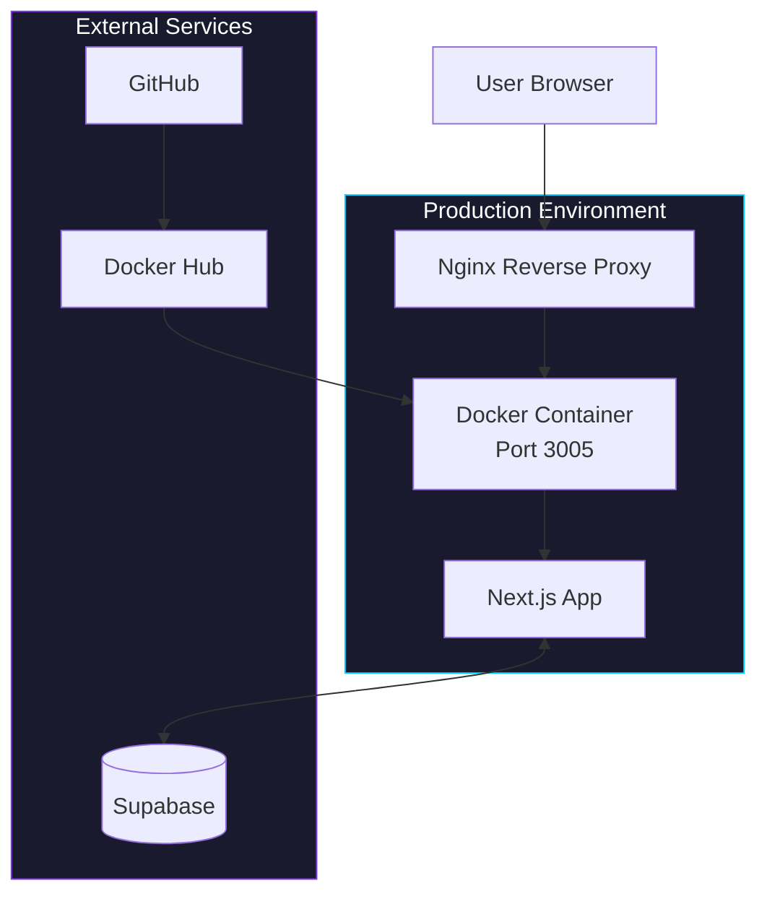

# System Architecture

## High-Level Architecture



## Assessment Flow



## Component Architecture

```mermaid
flowchart TB
    subgraph Frontend["Frontend Components"]
        LAND[LandingScreen]
        LOADER[ModelLoader]
        CALIB[CalibrationScreen]
        ENGINE[AssessmentEngine]
        OCEAN[OceanQuestionnaire]
        ANALYSIS[AnalysisScreen]
        RESULTS[CombinedResults]
    end

    subgraph API["API Routes"]
        R1[/api/auth]
        R2[/api/responses]
        R3[/api/jobs]
        R4[/api/applications]
        R5[/api/assessments]
    end

    subgraph ML["ML Models"]
        EM[Emotion Model<br/>MARKOV-v1.3]
        PM[Personality Model<br/>OCEAN-IRT-v2.1]
        JM[Job Matching<br/>Algorithm]
    end

    LAND --> LOADER --> CALIB --> ENGINE --> OCEAN --> ANALYSIS --> RESULTS
    ENGINE --> R2
    OCEAN --> R2
    ANALYSIS --> EM
    ANALYSIS --> PM
    R3 --> JM

    style Frontend fill:#0f0f1a,stroke:#00d4ff,color:#fff
    style API fill:#0f0f1a,stroke:#8338ec,color:#fff
    style ML fill:#0f0f1a,stroke:#4ade80,color:#fff
```

## User Roles Flow



## Data Flow



## Deployment Architecture


