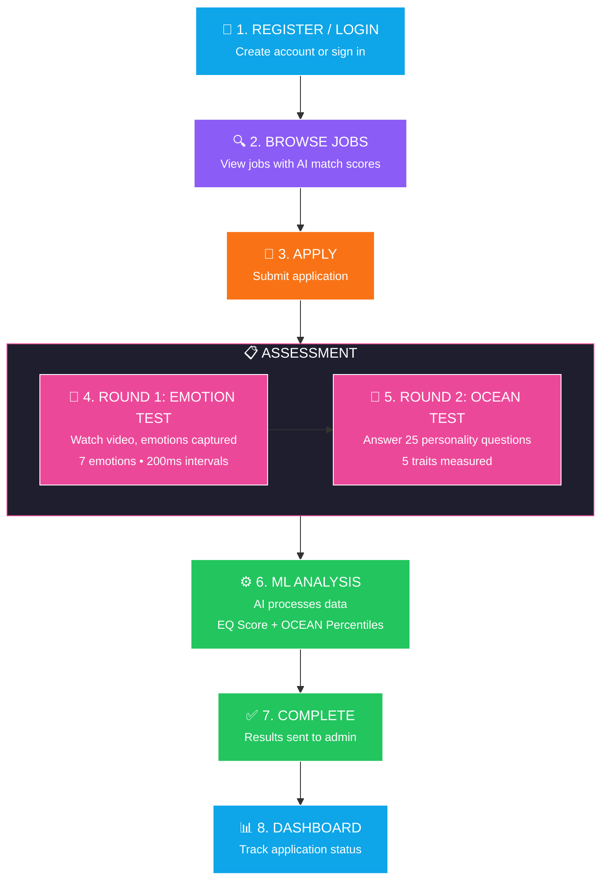
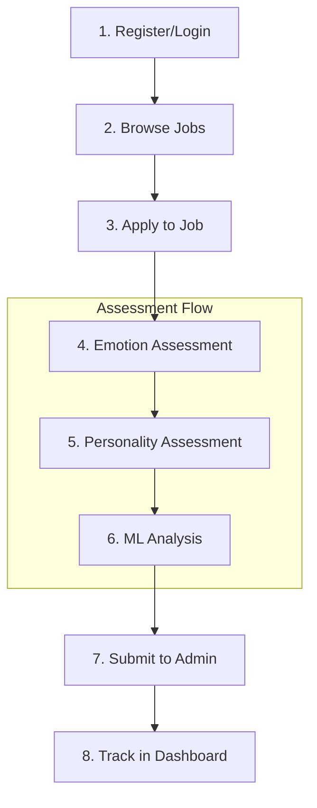
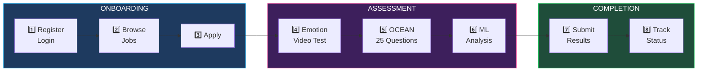
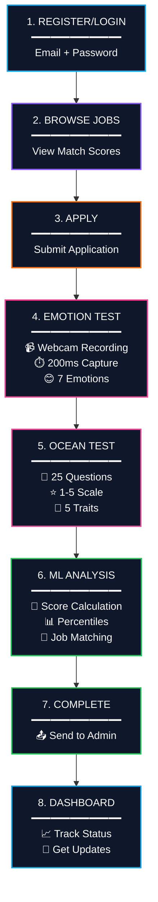

# Candidate Journey Flow Diagram

## Simple Linear Flow

```mermaid
flowchart LR
    A[1. Register/Login] --> B[2. Browse Jobs]
    B --> C[3. Apply]
    C --> D[4. Round 1:<br/>Emotion Test]
    D --> E[5. Round 2:<br/>OCEAN Test]
    E --> F[6. ML Analysis]
    F --> G[7. Complete]
    G --> H[8. Dashboard]

    style A fill:#00d4ff,stroke:#fff,color:#000
    style B fill:#8338ec,stroke:#fff,color:#fff
    style C fill:#fb5607,stroke:#fff,color:#fff
    style D fill:#ff006e,stroke:#fff,color:#fff
    style E fill:#ff006e,stroke:#fff,color:#fff
    style F fill:#4ade80,stroke:#fff,color:#000
    style G fill:#4ade80,stroke:#fff,color:#000
    style H fill:#00d4ff,stroke:#fff,color:#000
```



---

## Detailed Vertical Flow



---

## Clean Version (For Slides)



---

## Horizontal with Icons (Best for Presentation)



---

## With Data Flow Annotations



---

## Simple Box Version (Copy for PPT)

```
┌─────────────────────────────────────────────────────────────────┐
│                    CANDIDATE JOURNEY                             │
├─────────────────────────────────────────────────────────────────┤
│                                                                  │
│  ┌──────────┐    ┌──────────┐    ┌──────────┐                   │
│  │1.REGISTER│───►│2. BROWSE │───►│ 3. APPLY │                   │
│  │  LOGIN   │    │   JOBS   │    │          │                   │
│  └──────────┘    └──────────┘    └────┬─────┘                   │
│                                       │                          │
│                                       ▼                          │
│  ┌─────────────────────────────────────────────────────────┐    │
│  │                    ASSESSMENT                            │    │
│  │  ┌────────────┐  ┌────────────┐  ┌────────────┐         │    │
│  │  │ 4. EMOTION │─►│ 5. OCEAN   │─►│ 6. ML      │         │    │
│  │  │    TEST    │  │   TEST     │  │  ANALYSIS  │         │    │
│  │  │  (Video)   │  │(25 Ques.)  │  │ (Scoring)  │         │    │
│  │  └────────────┘  └────────────┘  └────────────┘         │    │
│  └─────────────────────────────────────┬───────────────────┘    │
│                                        │                         │
│                                        ▼                         │
│  ┌──────────┐    ┌──────────────────────────┐                   │
│  │8.DASHBOARD│◄──│ 7. COMPLETE              │                   │
│  │  (Track)  │   │   (Results → Admin)      │                   │
│  └──────────┘    └──────────────────────────┘                   │
│                                                                  │
└─────────────────────────────────────────────────────────────────┘
```

---

## Summary Table

| Step | Action | Details |
|------|--------|---------|
| 1 | Register/Login | Create account with email/password |
| 2 | Browse Jobs | View listings with AI match scores |
| 3 | Apply | Submit application for position |
| 4 | Emotion Test | Watch video, 7 emotions captured |
| 5 | OCEAN Test | Answer 25 personality questions |
| 6 | ML Analysis | AI calculates EQ + OCEAN scores |
| 7 | Complete | Results sent to admin for review |
| 8 | Dashboard | Track application status |
