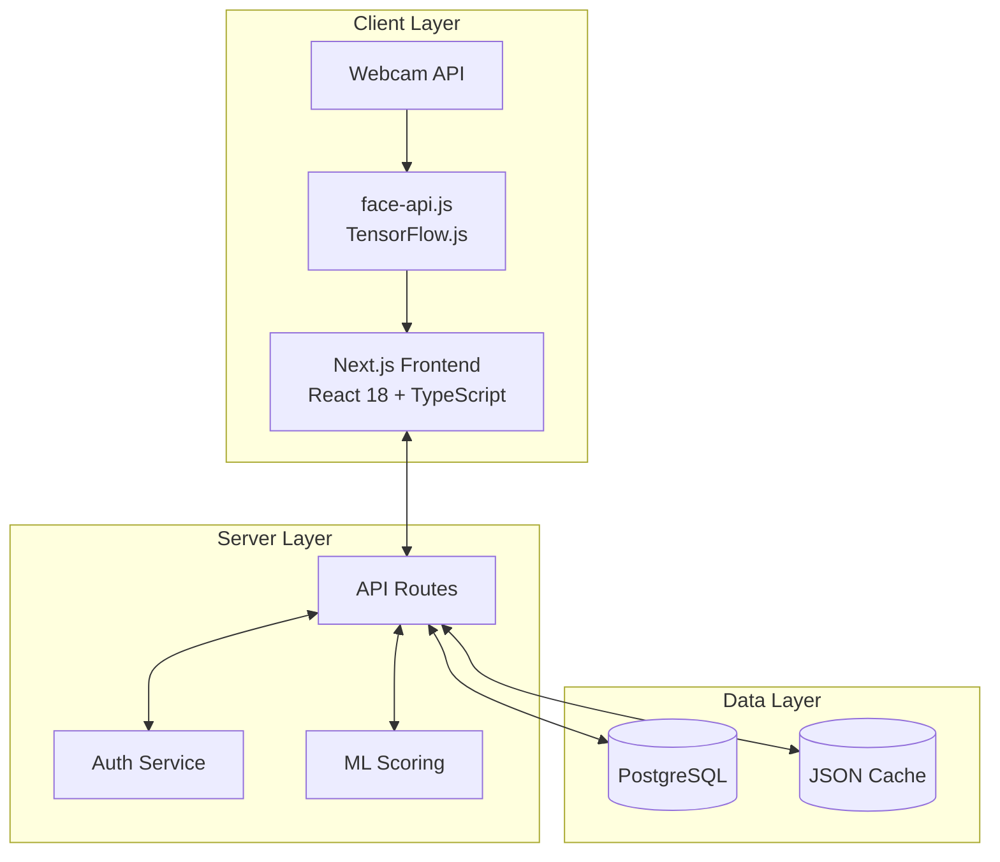
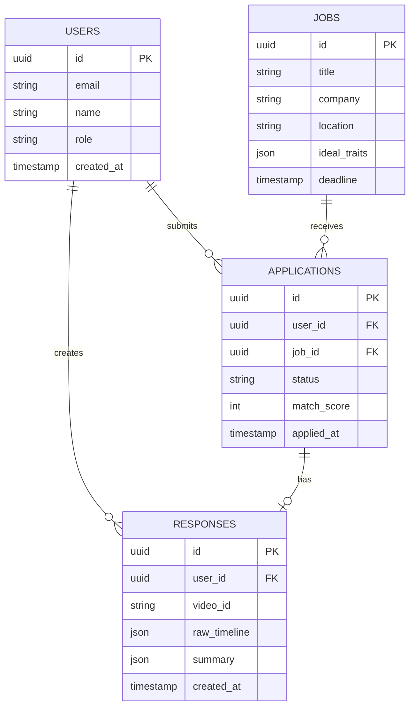
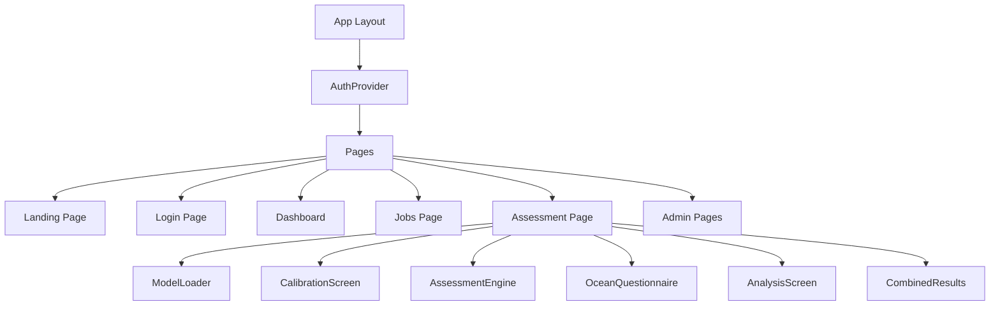
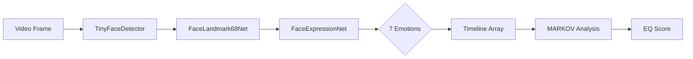
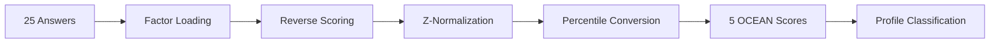
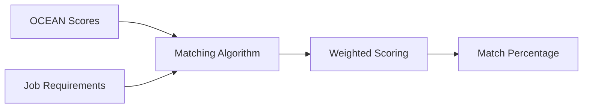
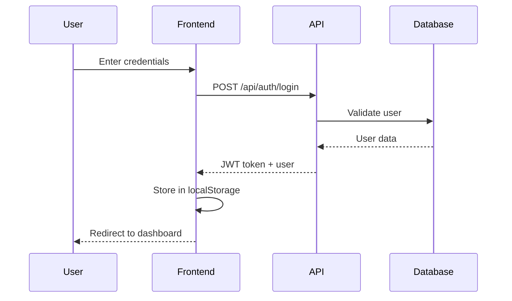
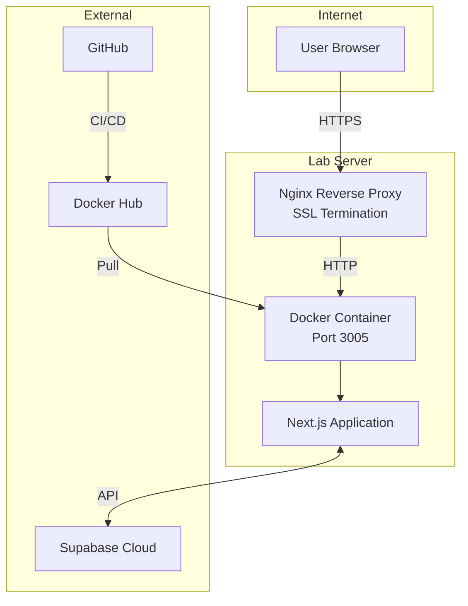

# Product Design: Architecture and Design

## 1. System Architecture Overview



### Architecture Decisions

| Decision | Choice | Rationale |
|----------|--------|-----------|
| Frontend Framework | Next.js 14 | SSR, API routes, file-based routing |
| ML Runtime | TensorFlow.js | Browser-based, no server GPU needed |
| Database | PostgreSQL | Relational, JSONB support, Supabase |
| Deployment | Docker | Portable, consistent environments |
| Styling | Tailwind CSS | Rapid development, utility-first |

---

## 2. Application Layers

### Layer 1: Presentation Layer
```
┌─────────────────────────────────────────────────────────┐
│                  PRESENTATION LAYER                      │
├─────────────────────────────────────────────────────────┤
│  Pages:                                                  │
│  • / (Landing)           • /login                       │
│  • /dashboard            • /jobs                        │
│  • /assessment           • /admin/*                     │
├─────────────────────────────────────────────────────────┤
│  Components:                                             │
│  • CalibrationScreen     • AssessmentEngine             │
│  • OceanQuestionnaire    • AnalysisScreen               │
│  • ModelLoader           • ResultsScreen                │
└─────────────────────────────────────────────────────────┘
```

### Layer 2: Business Logic Layer
```
┌─────────────────────────────────────────────────────────┐
│                 BUSINESS LOGIC LAYER                     │
├─────────────────────────────────────────────────────────┤
│  ML Models:                                              │
│  • emotion-model.ts      → EMOTION-MARKOV-v1.3          │
│  • personality-model.ts  → OCEAN-IRT-v2.1               │
│  • Job Matching          → Weighted scoring algorithm   │
├─────────────────────────────────────────────────────────┤
│  Services:                                               │
│  • Face Detection        • Score Calculation            │
│  • Authentication        • Job Matching                 │
└─────────────────────────────────────────────────────────┘
```

### Layer 3: Data Access Layer
```
┌─────────────────────────────────────────────────────────┐
│                  DATA ACCESS LAYER                       │
├─────────────────────────────────────────────────────────┤
│  API Endpoints:                                          │
│  • POST /api/auth/login      • POST /api/auth/register  │
│  • GET/POST /api/responses   • GET/POST /api/jobs       │
│  • GET/POST /api/applications • GET /api/assessments    │
├─────────────────────────────────────────────────────────┤
│  Storage:                                                │
│  • Supabase (PostgreSQL)     • Local JSON (fallback)    │
└─────────────────────────────────────────────────────────┘
```

---

## 3. Database Design

### Entity Relationship Diagram



### Database Schema

| Table | Columns | Purpose |
|-------|---------|---------|
| `users` | id, email, name, role, password_hash | User accounts |
| `jobs` | id, title, company, ideal_traits, deadline | Job listings |
| `applications` | id, user_id, job_id, status, match_score | Job applications |
| `responses` | id, user_id, raw_timeline, summary | Assessment results |

---

## 4. Component Design

### Frontend Component Hierarchy



### Key Components

| Component | Purpose | Key Features |
|-----------|---------|--------------|
| `ModelLoader` | Load face-api models | Progress bar, async loading |
| `CalibrationScreen` | Verify face detection | Webcam preview, stability check |
| `AssessmentEngine` | Capture emotions | Video sync, 200ms capture |
| `OceanQuestionnaire` | Personality test | 25 questions, Likert scale |
| `AnalysisScreen` | Show ML processing | Animated steps, progress |

---

## 5. ML Pipeline Design

### Emotion Detection Pipeline



### Personality Scoring Pipeline



### Job Matching Pipeline



---

## 6. UI/UX Design

### Design Principles

| Principle | Implementation |
|-----------|----------------|
| **Simplicity** | Clean layouts, minimal distractions |
| **Guidance** | Step-by-step assessment flow |
| **Feedback** | Real-time progress indicators |
| **Accessibility** | High contrast, keyboard navigation |

### Color Palette

```
Primary:    #00d4ff (Electric Blue)  - CTAs, highlights
Secondary:  #8338ec (Purple)         - Accents, admin
Warning:    #fb5607 (Orange)         - Alerts, pending
Success:    #4ade80 (Green)          - Completed, selected
Error:      #f87171 (Red)            - Errors, rejected
Background: #0f0f1a (Dark)           - Main background
```

### User Flow Design

```
┌─────────────────────────────────────────────────────────┐
│                    CANDIDATE FLOW                        │
└─────────────────────────────────────────────────────────┘
                           │
    ┌──────────────────────┼──────────────────────┐
    ▼                      ▼                      ▼
┌────────┐          ┌────────────┐          ┌─────────┐
│Register│ ───────► │ Dashboard  │ ───────► │Browse   │
│/Login  │          │            │          │Jobs     │
└────────┘          └────────────┘          └────┬────┘
                                                 │
                                                 ▼
                                           ┌─────────┐
                                           │ Apply   │
                                           └────┬────┘
                                                │
                    ┌───────────────────────────┘
                    ▼
    ┌─────────────────────────────────────────────────┐
    │              ASSESSMENT FLOW                     │
    │  ┌─────┐   ┌─────┐   ┌─────┐   ┌─────┐         │
    │  │Load │──►│Calib│──►│Video│──►│OCEAN│──►Done  │
    │  │Model│   │Face │   │Test │   │Test │         │
    │  └─────┘   └─────┘   └─────┘   └─────┘         │
    └─────────────────────────────────────────────────┘
```

---

## 7. API Design

### RESTful Endpoints

```
Authentication:
  POST   /api/auth/login      → Login user
  POST   /api/auth/register   → Register candidate

Jobs:
  GET    /api/jobs            → List all jobs
  POST   /api/jobs            → Create job (admin)
  PATCH  /api/jobs            → Update job (admin)
  DELETE /api/jobs?id=xxx     → Delete job (admin)

Applications:
  GET    /api/applications    → Get applications
  POST   /api/applications    → Submit application
  PATCH  /api/applications    → Update status

Assessments:
  GET    /api/assessments     → Get assessment results
  POST   /api/responses       → Save assessment data
```

### API Response Format

```json
{
  "success": true,
  "data": { ... },
  "error": null,
  "storage": "supabase" | "local"
}
```

---

## 8. Security Design

### Authentication Flow



### Security Measures

| Measure | Implementation |
|---------|----------------|
| Password Hashing | Simple hash (demo), bcrypt (production) |
| Role-based Access | Admin vs Candidate routes |
| Input Validation | Server-side validation |
| HTTPS | SSL/TLS in production |

---

## 9. Deployment Architecture



### Deployment Configuration

| Component | Configuration |
|-----------|---------------|
| Container Port | 3005 |
| Base Path | /emotion-capture |
| Nginx | Reverse proxy to container |
| SSL | Let's Encrypt / Institution cert |
| Docker Image | siddjeph/emotion-capture |

---

## 10. Design Summary

### Key Design Decisions

1. **Client-side ML** - No server GPU needed, privacy-friendly
2. **Serverless API** - Next.js API routes, easy deployment
3. **Dual Storage** - Supabase + local fallback for reliability
4. **Docker** - Consistent deployment across environments
5. **Modular Components** - Reusable, testable UI components

### Technology Stack Summary

```
┌─────────────────────────────────────────────────────────┐
│  FRONTEND          │  BACKEND           │  DATA         │
├────────────────────┼────────────────────┼───────────────┤
│  Next.js 14        │  Next.js API       │  PostgreSQL   │
│  React 18          │  Node.js 18        │  Supabase     │
│  TypeScript        │  JWT Auth          │  JSON Files   │
│  Tailwind CSS      │  REST API          │               │
│  face-api.js       │                    │               │
│  TensorFlow.js     │                    │               │
└────────────────────┴────────────────────┴───────────────┘
```
